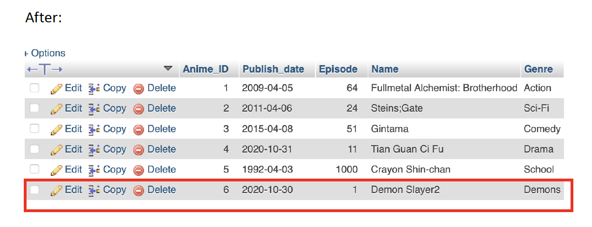

# Anime-Recommendation-Web

## Demo

- Welcome Page
  
- Register Page
  
- Login Page
  
- Anime Update page
  

---

## Functionality

- Add Anime to Database
  
- Uodate Anime in the database
  - Before
    
  - After
    
- Query By feature
  

---

## Installation

1. XAMPP

- [Mac OS Install](https://youtu.be/EK_AUTzV7OI)
- [Windows Install Tutorial](https://youtu.be/YFUOS4GZJD0)

- Open XAMPP
  
- Find IP address
  
- Enable localhost
  
- Enable Mont
  
- Find lampp folder
  
- Find htdocs folder
  
- Find "mysqli_connect.php" file
  

2. phpMyAdmin

- [Go to localhost:8080](http://localhost:8080/phpmyadmin/)
- Enter username: root, password: a72574213
  
- Load Create Table file
  
  
- Load the database
  
- Write mysqli_connect.php
  
